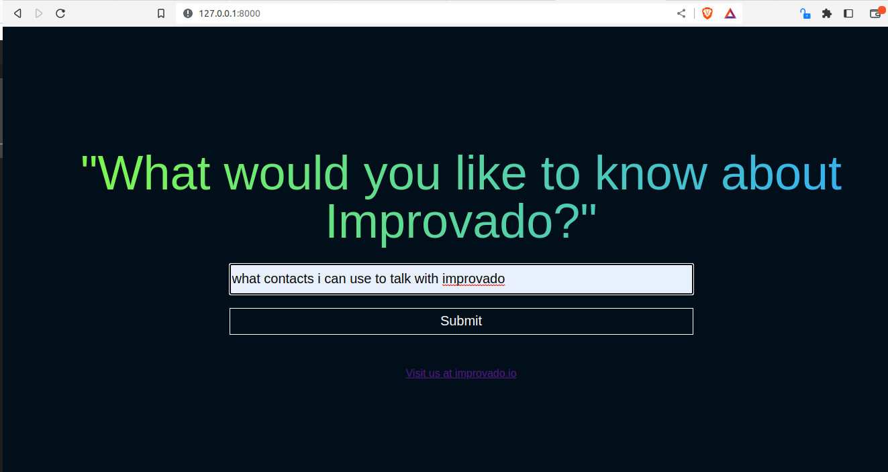
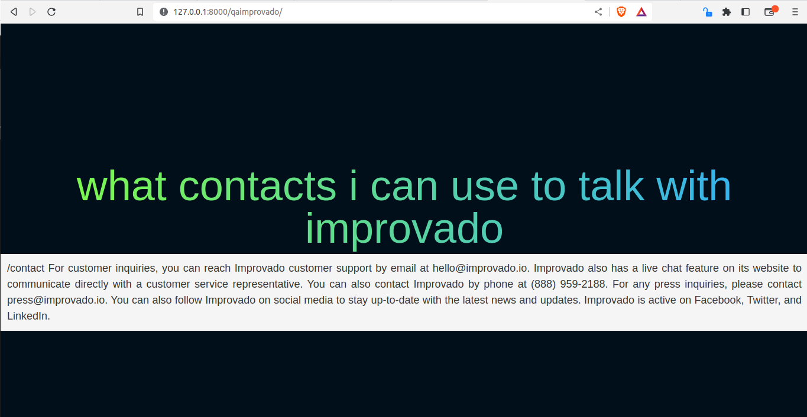

# question-answering-system
It is a question-answering application that interacts with the Improvado website using Django.

For the correct execution of the application in a local environment, the following steps should be followed:
1. The application was developed with the following dependencies:

            Django==4.2.1
            openai==0.27.6
            Python 3.10.6

2. This application interacts with the OPEN AI API for the question and answer system.  It is necessary to create an account in OPEN AI to obtain an API KEY and consume the CHAT GPT service.
This API Key should be configured in the settings.py file located in the following repository path:

            questionAnsweringSys/questionAnsweringSys/settings.py

To start the server for this application, execute the manage.py file located in the following path:
              questionAnsweringSys/manage.py

And run the following command to execute the manage.py file
                python3 manage.py runserver

3. The server is locally running on the http://127.0.0.1:8000 socket, and the following image indicates the homepage.
 

4. The following image shows an example of a response generated by Chat GPT. 

